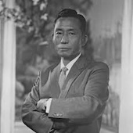
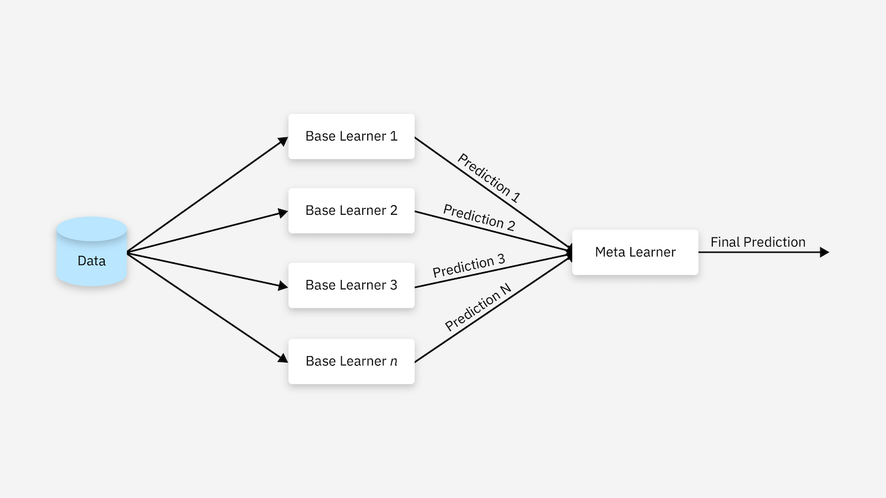

# 
**Meta-Learning**

## 1. **元学习**
元学习，也称为“学会学习”，是机器学习的一个子类别，它训练人工智能 模型自行理解和适应新任务。与传统的监督式学习不同，传统的监督式学习使用定义的训练数据集训练模型来解决特定任务，而元学习过程需要各种任务，每个任务都有自己的关联数据集。从这些多个学习事件中，模型获得了跨任务泛化的能力，这使它们能够快速适应新场景，即使数据很少。

一个常见的例子:假设给你看一个人的几张甚至一张照片,而后让你在几个人当中分辨出这个人,这对大多数人似乎并非一个困难的事情.尝试一下:

已知这四个人是同一个人,现在需要大家在接下来的四张图片中找到这个人:

相信大家只要不是过分脸盲~~或者对韩国总统们有一些了解~~应该都能认出第二张图片和第一组四个图片是同一个人,你仅仅用了四张图片就做到了这一点!这在传统机器学习里面是完全不敢想的!对此唯一合理的解释就是你掌握了认人的方法,这也是我们做元学习的目标:学习如何学习的技能。在你认人的过程中,你其实是用你已经掌握了的认人的技能,通过非常少量的数据来快速获得了通过图片判别谁是朴卡卡的能力(Few-Shot Learning).在这个过程中,你可以视自己为一个已经Well-Trained的Meta Model.

仔细想想,其实这里存在一个问题:我们所获得的先验知识究竟更像是迁移学习的过程(我看过很多很多人了并且知道他们是谁)还是元学习的过程(我从匹配外貌和具体的人知道了怎么判断谁是谁),这在后续正弦波的例子中会详细分析.事实上,迁移学习更像是在学习大规模数据的平均值.

### 1.1 **元学习和普通机器学习的区别**

|                  | 目的                                                                 | 输入                             | 函数 | 输出 | 流程                                                                 |
| :--------------- | :------------------------------------------------------------------- | :------------------------------- | :--- | :--- | :------------------------------------------------------------------- |
| Machine Learning | 通过训练数据，学习到输入 $X$ 与输出 $Y$ 之间的映射，找到函数 $f:X \rightarrow Y$             | $X$                                | $f$    | $Y$    | 1. 初始化 $f$ 参数 2. 喂数据点 $\{x_i, y_i\}_{i=1}^N$ 3. 计算 loss, 优化 $f$ 的参数 4. 得到$ y = f(x) $|
| Meta Learning    | 通过训练任务 $\mathcal{T}$ 及对应的训练数据 $\mathcal{D}$, 找到函数 $\mathcal{F}$。$\mathcal{F}$ 可以输出一个函数 $f$, $f$ 可用于新的任务 | $\mathcal{T}$ 及对应的训练数据 $\mathcal{D}$ | $\mathcal{F}$    | $f$    | 1. 初始化 $\mathcal{F}$ 参数 2. 喂训练任务$\{\mathcal{T_i(\mathcal{D})}\}_{i=1}^N$ 3. 计算 loss, 优化 $\mathcal{F}$ 的参数 4. 得到: $f = \mathcal{F}(\mathcal{T})$ 5. 新任务中: $Y = f(X)$ |

在机器学习中，训练单位是一条数据，通过数据来对模型进行优化；数据可以分为训练集、测试集和验证集。在元学习中，训练单位分层级了，第一层训练单位是任务，也就是说，元学习中要准备许多任务来进行学习，第二层训练单位才是每个任务对应的数据。机器学习和元学习二者的目的都是找一个Function，只是两个Function的功能不同，要做的事情不一样。机器学习中的Function直接作用于特征和标签，去寻找特征与标签之间的关联；而元学习中的Function是用于寻找新的f，新的f才会应用于具体的任务。

### 1.2 **元学习的工作原理**

元学习涉及两个关键阶段：元训练和元测试。对于这两个阶段，基础学习器模型在学习过程中会调整和更新其参数。使用的数据集分为用于元训练的支持集和用于元测试的测试集。在元训练阶段，基本学习器模型提供了一系列任务。该模型的目标是发现这些任务之间的常见模式，并获得可用于解决新任务的广泛知识。在元测试阶段，通过为基本学习器模型分配训练时未遇到的任务来评估其性能。模型的有效性是通过它利用所学知识和一般理解适应这些新任务的程度和速度来衡量的。

用我们在**1. 元学习**当中举的例子,我们的元训练阶段就是在日常生活中,我们认识其他人的过程,在这个过程中我们学会把人的外貌和具体的人联系在一起,元测试就是我们看了四张朴卡卡的照片,然后顺利的在李卡卡、朴卡卡、尹卡卡和文卡卡四个人的照片中找出朴卡卡.

### 1.3 **常见元学习方法**

- 基于度量的元学习 (Metric-based Meta-Learning)
  1. 孪生神经网络 (Siamese neural network)
  2. 匹配网络 (Matching networks)
  3. 关系网络 (Relation networks)
  4. 原型网络 (Prototypical networks)
   
- 基于模型的元学习 (Model-based Meta-Learning)
  1. 内存增强神经网络 (Memory-augmented neural networks)
  2. 元网络 (Meta networks)
   
- **基于优化的元学习 (Optimization-based Meta-Learning)**
  1. LSTM元学习器 (LSTM meta-learner)
  2. **模型无关元学习 (Model-agnostic meta learning, MAML)**
  3. Reptile (FOMAML Based)
   
## 2. **模型无关元学习**

### 2.1 MAML基础知识

Model-Agnostic Meta Learning, 模型无关元学习,其含义就是不论什么深度学习模型,都可以套用 MAML 的框架进行训练,可以应用在分类任务、回归任务甚至强化学习上,这也奠定了其广泛的应用范围.以分类任务为例, MAML 可以理解为一种 N-way K-shot Q-query learning,  N 代表用于分类的类别数量, K 为每个类别用于训练的样本数量, Q 则为每个类别用于验证的样本数量.
  
MAML 原论文中多次出现名词 task，模型的训练过程都是围绕 task 展开的，而我们到目前为止并没有给它下一个明确的定义。要正确地理解 task，我们需要了解的相关概念包括$D_{meta-train}$，$D_{meta-test}$，support set, query set, meta-train classes, meta-test classes等等。下面举个例子看看是否有助于理解:

假设这样一个场景：我们需要利用 MAML 训练一个数学模型模型 $M_{finetune}$，目的是对未知标签的图片做分类，我们要预测的类别包括 $P_1 \sim P_5$（每类5个已标注样本用于训练，另外每类有15个已标注样本用于测试）。我们的训练数据包括另外10个类别的图片 $C_1 \sim C_{10}$（每类30个已标注样本），用于帮助训练元学习模型 $M_{meta}$。实验设置为5-way 5-shot 15-query。

我们的具体训练过程大致是：MAML首先利用 $C_1 \sim C_{10}$ 的数据集训练元模型$M_{meta}$，再在$P_1 \sim P_5$的数据集上微调(finetune) 得到最终的模型 $M_{finetune}$。此时，$C_1 \sim C_{10}$即 meta-train classes，$C_1 \sim C_{10}$包含的共计300个样本，即 $D_{meta-train}$，是用于训练 $M_{meta}$ 的数据集。与之相对的，$P_1 \sim P_5$即meta-test classes，$P_1 \sim P_5$包含的共计100个样本，即 $D_{meta-test}$，是用于训练和测试 $M_{fine-tune}$ 的数据集。

根据 5-way 5-shot 15-query 的实验设置，我们在训练 $M_{meta}$ 阶段，从 $C_1 \sim C_{10}$ 中随机取5个类别，每个类别再随机取20个已标注样本，组成一个task $\mathcal{T}$。其中的5个已标注样本称为 $\mathcal{T}$ 的 support set，另外15个样本称为 $\mathcal{T}$ 的query set。这个task $\mathcal{T}$，就相当于普通深度学习模型训练过程中的一条训练数据。那我们肯定要组成一个batch，才能做随机梯度下降SGD, 因此我们反复在训练数据分布中抽取若干个这样的task $\mathcal{T}$，组成一个batch。在训练 $M_{finetune}$ 阶段，task、support set、query set的含义与训练 $M_{meta}$ 阶段均相同。

### 2.2 模型无关元学习算法

MAML的核心算法可以用以下伪代码表示：

**Algorithm: Model-Agnostic Meta-Learning**

**Require:** $p(\mathcal{T})$: distribution over tasks  
**Require:** $\alpha, \beta$: step size hyperparameters

1: randomly initialize $\theta$  
2: **while** not done **do**  
3: &nbsp;&nbsp;&nbsp;&nbsp;Sample batch of tasks $\mathcal{T}_i \sim p(\mathcal{T})$  
4: &nbsp;&nbsp;&nbsp;&nbsp;**for all** $\mathcal{T}_i$ **do**  
5: &nbsp;&nbsp;&nbsp;&nbsp;&nbsp;&nbsp;&nbsp;&nbsp;Evaluate $\nabla_\theta \mathcal{L}_{\mathcal{T}_i}(f_\theta)$ with respect to K examples  
6: &nbsp;&nbsp;&nbsp;&nbsp;&nbsp;&nbsp;&nbsp;&nbsp;Compute adapted parameters with gradient descent: $\theta'_i = \theta - \alpha\nabla_\theta \mathcal{L}_{\mathcal{T}_i}(f_\theta)$  
7: &nbsp;&nbsp;&nbsp;&nbsp;**end for**  
8: &nbsp;&nbsp;&nbsp;&nbsp;Update $\theta \leftarrow \theta - \beta\nabla_\theta \sum_{\mathcal{T}_i \sim p(\mathcal{T})} \mathcal{L}_{\mathcal{T}_i}(f_{\theta'_i})$  
9: **end while**

该算法的核心思想是通过两层优化结构来实现元学习：
- **内层优化**（步骤5-6）：对每个任务进行快速适应，通过少数几个梯度步骤获得任务特定参数
- **外层优化**（步骤8）：更新元参数，使得模型能够在新任务上快速适应并取得良好性能

其变体 MAML++ 主要改进点在于开放了内循环的可学习学习率(learnable inner loop learning rate), 即在算法第**8**步的时候根据元梯度再Update一下内循环学习率$\beta$,有助于模型的快速收敛.

值得一提,这里展示的算法其实是做了一阶近似的 FOMAML(First-Order MAML),具体的近似位置见下数学推导.

### 2.3 简单推导

在推导过程中为了区分整体模型和模型中的某个单独参数,我们将整体模型视为一个包含其所有参数的向量,记号和约定见下:

- 元模型使用$\mathbf{\phi}$表示,参与适应的模型使用$\mathbf{\theta}$表示(从元模型适应一步得到),模型共有$n$个参数
- 模型的第$k$个参数写为下标形式,即$\phi_k$或$\theta_k$,对于第$i$个任务将对应适应后的模型写作上标,即$\mathbf{\theta^i}$
- 记内循环学习率和外循环学习率分别为$\alpha$和$\beta$,任务$\mathcal{T_i}\sim p(\mathcal{T})$,损失函数$\mathcal{L}$
- 本推导假设仅执行一次内循环训练以求简化
  
从伪代码当中可知,内循环的训练与普通神经网络训练别无二致,可以写为:

$$
\mathbf{\theta} = \mathbf{\phi} - \alpha\mathbf{\nabla}_{\phi}\mathcal{L}(\mathbf{\phi})
$$

对齐每一个分量后,向量式写开以后可以变为:

$$
\begin{bmatrix}
\theta_1 \\
\vdots \\
\theta_k \\
\vdots \\
\theta_n
\end{bmatrix}
=
\begin{bmatrix}
\phi_1 \\
\vdots \\
\phi_k \\
\vdots \\
\phi_n
\end{bmatrix}
-
\alpha
\begin{bmatrix}
\frac{\partial \mathcal{L}(\mathbf{\phi})}{\partial \phi_1} \\
\vdots \\
\frac{\partial \mathcal{L}(\mathbf{\phi})}{\partial \phi_k} \\
\vdots \\
\frac{\partial \mathcal{L}(\mathbf{\phi})}{\partial \phi_n}
\end{bmatrix}
$$

我们的目标是要完成元参数$\mathbf{\phi}$的
更新,即:

$$
\mathbf{\phi^\prime} = \mathbf{\phi} - \beta\mathbf{\nabla}_{\phi}\sum_{\mathcal{T}_i\sim p(\mathcal{T})}\mathcal{L^i}(\mathbf{\theta^i})
$$

单拿模型中的第$k$个参数出来,即

$$
\phi_k^\prime = \phi_k - \beta\sum_{\mathcal{T}_i\sim p(\mathcal{T})}\frac{\partial\mathcal{L^i}(\mathbf{\theta^i})}{\partial \phi_k}
$$

考虑到链式法则$\phi_k \rightarrow \{\theta_j\}_1^{n} \rightarrow \mathcal{L}(\mathbf{\theta})$和内循环参数的更新公式,我们有:

$$
\begin{aligned}
\phi_k^\prime &= \phi_k - \beta\sum_{\mathcal{T}_i\sim p(\mathcal{T})}\frac{\partial\mathcal{L^i}(\mathbf{\theta^i})}{\partial \phi_k} \\
&= \phi_k - \beta\sum_{\mathcal{T}_i\sim p(\mathcal{T})}\sum_{j}^{n}\frac{\partial\mathcal{L^i}(\mathbf{\theta^i})}{\partial \theta^i_j}\frac{\partial \theta^i_j}{\partial\phi_k}\\
&= \phi_k - \beta\sum_{\mathcal{T}_i\sim p(\mathcal{T})}\sum_{j}^{n}\frac{\partial\mathcal{L^i}(\mathbf{\theta^i})}{\partial \theta^i_j}\frac{\partial \phi_j - \alpha\frac{\partial \mathcal{L}^i(\mathbf{\phi})}{\partial \phi_j}}{\partial\phi_k}\\
&= \phi_k - \beta\sum_{\mathcal{T}_i\sim p(\mathcal{T})}\sum_{j}^{n}\frac{\partial\mathcal{L^i}(\mathbf{\theta^i})}{\partial \theta^i_j}\left(\frac{\partial \phi_j}{\partial\phi_k} - \alpha\frac{\partial^2\mathcal{L}^i(\mathbf{\phi})}{\partial \phi_k \partial \phi_j}\right)
\end{aligned}
$$

对于$\left(\frac{\partial \phi_j}{\phi_k} - \alpha\frac{\partial^2\mathcal{L}^i(\mathbf{\phi})}{\partial \phi_k \partial \phi_j}\right)$这一项,其中涉及到二阶导数的计算,这对计算开销提出了很高的要求,在此予以忽略(FOMAML的由来),第一项当且仅当$j=k$时取$1$,其余时候均为$0$,则最后可以得到元模型参数更新公式:

$$
\phi_k^\prime = \phi_k - \beta\sum_{\mathcal{T}_i\sim p(\mathcal{T})}\frac{\partial\mathcal{L^i}(\mathbf{\theta^i})}{\partial \theta_k^i}
$$

从而在忽略二阶导数时,元模型的更新公式可以写为:

$$
\mathbf{\phi^\prime} = \mathbf{\phi} - \beta\mathbf{\nabla}_{\phi}\sum_{\mathcal{T}_i\sim p(\mathcal{T})}\mathcal{L^i}(\mathbf{\theta^i}) \approx \mathbf{\phi} - \beta\sum_{\mathcal{T}_i\sim p(\mathcal{T})}\mathbf{\nabla}_{\theta^i}\mathcal{L^i}(\mathbf{\theta^i})
$$
### 2.4 工程实现与讨论

- [Omniglot图像分类问题](./Omniglot.ipynb)
- [正弦波回归问题](./SineRegression.ipynb)
- [MetaScore实现](./MetaScore.ipynb)