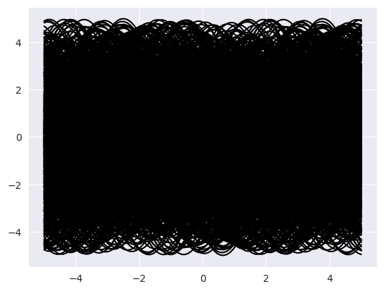
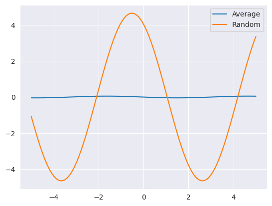
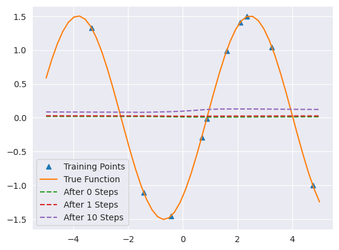
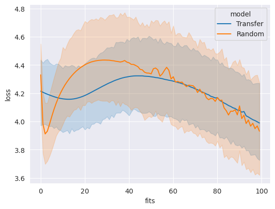
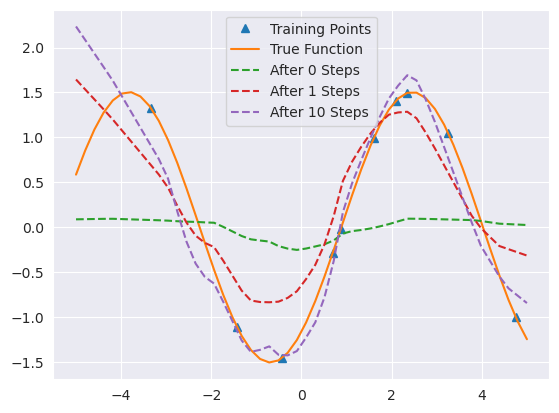
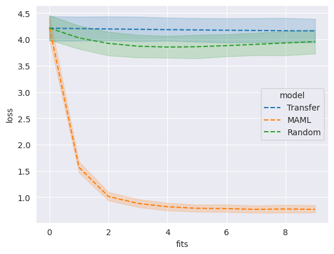

# 
Meta-Learning

## 1. What is Meta-Learning?

元学习，又被称为"学习如何学习"(Learning to Learn)。下表通俗（但不严谨）的解释了机器学习和元学习的区别。

|                  | 目的                                                                 | 输入                             | 函数 | 输出 | 流程                                                                 |
| :--------------- | :------------------------------------------------------------------- | :------------------------------- | :--- | :--- | :------------------------------------------------------------------- |
| Machine Learning | 通过训练数据，学习到输入 $X$ 与输出 $Y$ 之间的映射，找到函数 $f:X \rightarrow Y$             | $X$                                | $f$    | $Y$    | 1. 初始化 $f$ 参数 2. 喂数据点 $\{x_i, y_i\}_{i=1}^N$ 3. 计算 loss, 优化 $f$ 的参数 4. 得到$ y = f(x) $|
| Meta Learning    | 通过训练任务 $\mathcal{T}$ 及对应的训练数据 $\mathcal{D}$, 找到函数 $\mathcal{F}$。$\mathcal{F}$ 可以输出一个函数 $f$, $f$ 可用于新的任务 | $\mathcal{T}$ 及对应的训练数据 $\mathcal{D}$ | $\mathcal{F}$    | $f$    | 1. 初始化 $\mathcal{F}$ 参数 2. 喂训练任务$\{\mathcal{T_i(\mathcal{D})}\}_{i=1}^N$ 3. 计算 loss, 优化 $\mathcal{F}$ 的参数 4. 得到: $f = \mathcal{F}(\mathcal{T})$ 5. 新任务中: $y = f(x)$ |

在机器学习中，训练单位是一条数据，通过数据来对模型进行优化；数据可以分为训练集、测试集和验证集。在元学习中，训练单位分层级了，第一层训练单位是任务，也就是说，元学习中要准备许多任务来进行学习，第二层训练单位才是每个任务对应的数据。机器学习和元学习二者的目的都是找一个Function，只是两个Function的功能不同，要做的事情不一样。机器学习中的Function直接作用于特征和标签，去寻找特征与标签之间的关联；而元学习中的Function是用于寻找新的f，新的f才会应用于具体的任务。

## 2. Why Meta-Learning?

### 2.1 少样本学习

少样本学习，即模型在少量样本存在的情况下学习如何泛化，常用的方法主要有元学习和迁移学习。元学习的介绍见前，迁移学习其实已经
用的很多了，比如对于无标记数据库展开的大规模预训练，就属于迁移学习的范畴，下面会具体介绍迁移学习的定义。

### 2.2 迁移学习

迁移学习是由域和任务定义的。域 $\mathcal{D}$ 由特征空间 $\mathcal{X}$ 和边缘概率分布 $P(X)$ 构成，其中 $X = \{x_1, \ldots, x_n\} \in \mathcal{X}$。给定域 $\mathcal{D} = \{\mathcal{X}, P(X)\}$，任务由标签空间 $\mathcal{Y}$ 和目标预测函数 $f: \mathcal{X} \rightarrow \mathcal{Y}$ 两部分组成，函数 $f$ 预测 $x$ 对应的标签 $f(x)$。任务 $\mathcal{T} = \{\mathcal{Y}, f(x)\}$ 是从含有样本对 $\{x_i, y_i\}$ 的训练数据中学习得到的，其中 $x_i \in X, y_i \in \mathcal{Y}$。

给定原域 $\mathcal{D_S}$ 和任务 $\mathcal{T_S}$，目标域 $\mathcal{D_T}$ 和任务 $\mathcal{T_T}$，迁移学习的目标是利用 $\mathcal{D_S}$ 和 $\mathcal{T_S}$ 学到的知识，帮助学习 $\mathcal{D_T}$ 域的目标函数 $f_T$。

### 2.3 元学习 vs 迁移学习

其实元学习和迁移学习某种程度上很相似，他们都在为模型学习一个良好的初始化，只是他们学习初始化的方式不同。元学习期望学习的权重是一个具有良好泛化能力，能在少样本上快速适应的一个generalizable的模型，相比之下，迁移学习中学到的模型只是一个在原域上表现良好的模型，并不意味着这个模型在期待的目标域上也能表现良好，这里面更多是人们的一厢情愿（it just happens to be effective），有效与否需要实验验证。

可以举个例子，即经典的SineRegression问题。

**SineRegression**

Sine Regression（正弦回归）问题是经典的回归任务之一，常用于评估模型在少样本学习（few-shot learning）场景下的泛化和快速适应能力。

具体来说，Sine Regression 问题的目标是让模型能够拟合一组不同参数的正弦函数。每个任务（task）对应一个不同的正弦曲线，其函数形式为：

$$
y = a \sin( x + b)
$$

其中：
- $a$ 表示振幅，通常从某个区间（如 $[0.1, 5.0]$）中随机采样；
- $b$ 表示相位，通常从 $[0, 2\pi]$ 区间中随机采样。

在元学习设置下，每个任务会随机采样一组 $(a, b)$，并从该正弦曲线中采样少量数据点 $(x_i, y_i)$ 作为训练集，模型需要根据这些少量样本快速拟合出对应的正弦函数。

为了能够在采样的少量数据点上成功复现出对应的正弦函数，初始模型需要具有良好的泛化能力，即能够从少量数据中学习出对应的正弦函数。对于迁移学习来说，我们假设可以期望从其他许多不同的SineRegression任务（对应于不同的 $(a, b)$）中学习到有用的信息，并将其迁移到当前任务中。当然，很快我们就会发现，这纯粹是一厢情愿。假设我们随机采样1000个SineRegressionTask，并以此为基础进行训练，我们可以把这1000个Sine函数可视化一下：

从图中可以看到，对于这1000个函数组成的数据集，每一个$x_i$上都会对应多个不同的$y_i$，自然而然，要最小化loss，模型学习到每个$x_i$上对应的结果应该是所有$y_i$的平均值，不难预料，由于随机采样的缘故，每个$x_i$上对应的$y_i$的平均值将会收敛到0，如下图所示。

如此，我们就大费周章从1000个任务中训练出了一个全零初始化！你期望这个初始化能在一个特定的SineRegressionTask上只用少样本快速拟合对应的$y=a\sin(x+b)$？显然这是不可能的！严谨起见，我们还是做了一下实验，结果如下：

可以看到，在1000个任务上训练出的模型在单个任务上表现非常差，这进一步验证了迁移学习中人们“一厢情愿”的成分。更进一步，我们可以迁移学习得到的全零初始化和随机初始化进行损失对比，结果如下：

所以其实我们很难说在该情境下，迁移学习得到的初始化比随机初始化好。

但是元学习不一样，以基于优化的元学习为例，其损失函数（后面会写）就是被设计为能够学习到具有良好泛化能力的初始化，并不含有任何人主观引入的先验信息（比如通过相似的预训练一定会在相似的任务上获得更好的信息），所以元学习得到的初始化在单个任务上表现很好，如下图所示：

除了拟合能力外，我们还可以发现随着适应步数的增加，元学习得到的模型在单个任务上的表现越来越好。接下来放一下几种方法对比的图：

相较于其他初始化，我们可以认为元学习学到的初始化更加有效。注意，这只是在SineRegressionTask任务上的表现，根据NFL定理，在其他任务上表现如何需要实验验证。不过，这从侧面印证了元学习确实是少样本学习情境下一个值得考虑的方式。

## 3. How to do Meta-Learning?

